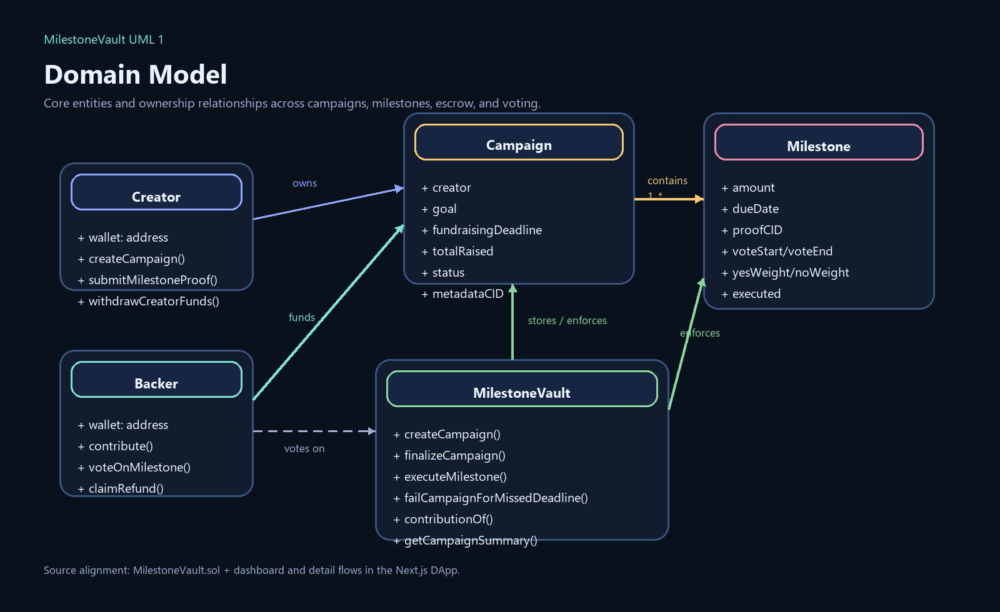
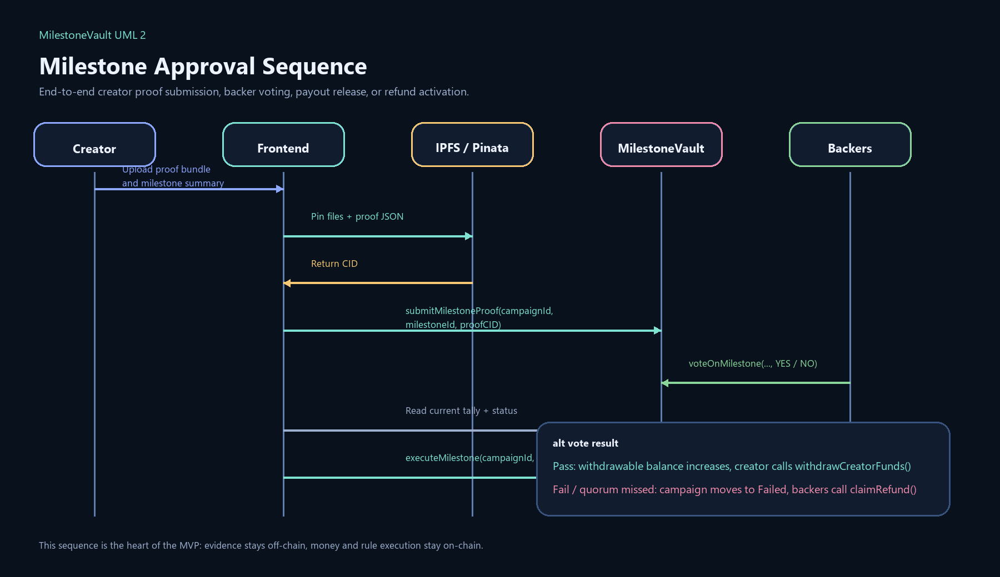

# MilestoneVault 🏗️

**Decentralized Milestone-Based Crowdfunding with Phased Payouts via Backer Voting**

> Locking crowdfunding capital in smart contracts to be released in phases via backer voting on milestones; enabling rule-based refunds upon failure or missed targets. Shifting from "Trusting the Platform" to "Trusting the Code."

## GitHub Pages Demo

- Repository: [FT5004-Group-66-Project](https://github.com/gengyuzhu/FT5004-Group-66-Project)
- Interactive repository demo: [MilestoneVault GitHub Pages](https://gengyuzhu.github.io/FT5004-Group-66-Project/)
- Real DApp code: [`web/`](./web)
- Static showcase for GitHub Pages: [`docs/`](./docs)

The `web/` app is the real Next.js DApp with wallet actions and contract calls. The `docs/` folder contains a static, interactive GitHub Pages showcase with the same visual direction, so the repository itself can present a web-style product experience on GitHub without the old documentation-heavy top navigation.

---

## Overview

MilestoneVault is a milestone-based crowdfunding DApp that addresses the core trust problem in traditional crowdfunding: fund escrow and rule execution rely on centralized platforms. By moving funds and governance logic on-chain, MilestoneVault provides:

- **Verifiable, tamper-evident fund custody** — Funds are escrowed by the smart contract, not by a company or platform operator
- **Milestone-based phased payouts** — Creators receive funds only after each milestone passes a backer vote
- **On-chain voting** — Contribution-weighted voting with a fixed quorum and time-boxed voting window
- **Automatic refunds** — If a campaign is underfunded, a milestone vote fails, or a deadline is missed, backers can claim proportional refunds from unreleased escrow
- **IPFS evidence storage** — Campaign metadata and milestone proof live off-chain, while CIDs are stored on-chain for integrity verification
- **Responsive product UI** — A real Next.js DApp and a matching GitHub Pages demo both support desktop and mobile layouts
- **User-friendly interaction layer** — The dashboard now includes live sorting, stronger card hierarchy, skeleton loading states, draft readiness feedback, and a clearer action assistant on campaign detail pages

## Architecture

```text
┌───────────────────────────────────────────────────────────┐
│                      Frontend (DApp)                      │
│   Next.js/React + wagmi/viem + MetaMask wallet flow       │
│   Dashboard, create, detail, vote, withdraw, refund       │
└────────────────────────┬──────────────────────────────────┘
                         │ Read/Write via JSON-RPC
┌────────────────────────▼──────────────────────────────────┐
│              MilestoneVault Smart Contract                │
│        Solidity 0.8.24 + OpenZeppelin ReentrancyGuard     │
│                                                           │
│   On-chain state:                                         │
│   • Campaign registry (creator, goal, deadline, status)   │
│   • Milestone definitions (amounts, due dates, votes)     │
│   • Contribution ledger (backer -> amount per campaign)   │
│   • Withdrawable balances and refund pool accounting      │
└────────────────────────┬──────────────────────────────────┘
                         │
┌────────────────────────▼──────────────────────────────────┐
│                 Off-chain Storage (IPFS)                  │
│   Metadata and evidence files -> CID written on-chain     │
│   Pinata in production, mock IPFS in Playwright E2E       │
└───────────────────────────────────────────────────────────┘
```

## Smart Contract State Machine

```text
                    ┌─────────────┐
        create      │ Fundraising │
       ────────────>│   (0)       │
                    └──────┬──────┘
                           │ finalizeCampaign() after deadline
                    ┌──────▼──────┐
               NO   │ goal met?   │  YES
              ┌─────┤             ├─────┐
              │     └─────────────┘     │
       ┌──────▼──────┐          ┌───────▼──────┐
       │   Failed    │          │   Active     │
       │   (1)       │          │   (2)        │
       └──────┬──────┘          └───────┬──────┘
              │                         │ submitProof → vote → execute
              │                  ┌──────▼───────┐
              │             NO   │ vote passed? │  YES
              │            ┌─────┤              ├────────┐
              │            │     └──────────────┘        │
              │     ┌──────▼──────┐             ┌────────▼────────┐
              │     │   Failed    │        ALL  │ Next milestone  │
              │     │   (1)       │   ┌─────────┤ or Completed(3) │
              │     └─────────────┘   │         └─────────────────┘
              │                       │
              ▼                       ▼
         claimRefund()       withdrawCreatorFunds()
```

## UML

Two core UML diagrams are rendered as PNG assets so they display directly on GitHub:





More UML source diagrams and Mermaid versions are available in [`docs/uml.md`](./docs/uml.md).

## Project Structure

```text
FT5004-Group-66-Project/
├── contracts/
│   ├── contracts/
│   │   ├── MilestoneVault.sol              # Core smart contract
│   │   └── test/
│   │       └── ReentrantRefundAttacker.sol # Reentrancy safety helper
│   ├── deployments/
│   │   └── milestone-vault-addresses.json  # Local/Sepolia deployment export
│   ├── scripts/
│   │   ├── deploy.js                       # Hardhat deployment script
│   │   └── export-frontend.js              # ABI/address sync into web/
│   ├── test/
│   │   └── MilestoneVault.test.js          # 39 unit tests (all passing)
│   ├── hardhat.config.js
│   ├── package.json
│   └── .env.example
├── docs/
│   ├── assets/
│   │   ├── uml-domain-model.png
│   │   └── uml-milestone-sequence.png
│   ├── index.html                          # GitHub Pages interactive showcase
│   ├── site.css
│   ├── site.js
│   ├── architecture.md
│   ├── demo-script.md
│   ├── limitations.md
│   └── uml.md
├── web/
│   ├── e2e/
│   │   ├── api-validation.spec.ts
│   │   ├── campaign-create.spec.ts
│   │   ├── proof-submission.spec.ts
│   │   └── support/
│   ├── scripts/
│   │   └── e2e-dev-server.mjs
│   ├── src/
│   │   ├── app/
│   │   ├── components/
│   │   └── lib/
│   ├── playwright.config.ts                # Frontend E2E config
│   ├── package.json
│   └── .env.example
├── .github/
├── .gitignore
├── LICENSE
└── README.md
```

## Getting Started

### Prerequisites

- Node.js 20.x recommended
- MetaMask browser extension
- Git
- Playwright browsers for E2E: `cd web && npm run e2e:install`

### 1. Install Dependencies

```bash
cd contracts
npm install

cd ../web
npm install
```

### 2. Configure Environment Variables

Copy the provided templates:

```bash
cd contracts
Copy-Item .env.example .env

cd ../web
Copy-Item .env.example .env.local
```

Key environment values:

- `contracts/.env`
  - `SEPOLIA_RPC_URL`
  - `SEPOLIA_PRIVATE_KEY`
  - `ETHERSCAN_API_KEY`
  - `MILESTONE_QUORUM_BPS=2000`
  - `MILESTONE_VOTING_DURATION=259200`
- `web/.env.local`
  - `PINATA_JWT`
  - `NEXT_PUBLIC_IPFS_GATEWAY_URL`
  - `NEXT_PUBLIC_DEFAULT_CHAIN_ID=31337`
  - `NEXT_PUBLIC_LOCAL_RPC_URL=http://127.0.0.1:8545`
  - `NEXT_PUBLIC_SEPOLIA_RPC_URL`

### 3. Compile Contract

```bash
cd contracts
npm run compile
```

### 4. Run Smart Contract Tests

```bash
cd contracts
npm test
```

Expected output: **39 passing** contract tests covering campaign creation, contributions, milestone proof, voting, execution, refund behavior, and deadline failure handling.

### 5. Run Local Blockchain And Deploy

Terminal 1 — Start local blockchain:

```bash
cd contracts
npm run node
```

Terminal 2 — Deploy and export ABI/address into the frontend:

```bash
cd contracts
npm run deploy:localhost
```

This writes the deployed address to `contracts/deployments/milestone-vault-addresses.json` and syncs the ABI/address used by the Next.js app.

### 6. Launch The Real DApp

```bash
cd web
npm run dev
```

Then open [http://localhost:3000](http://localhost:3000) and:

1. Connect MetaMask
2. Switch to `localhost:8545` (Chain ID `31337`)
3. Create campaigns, contribute, submit proof, vote, execute milestones, withdraw, and claim refunds

### 7. Run Frontend E2E

```bash
cd web
npm run e2e
```

Expected output: **4 passing** Playwright tests covering campaign creation, proof submission, and strict IPFS route validation.

### 8. Deploy To Sepolia

Update `contracts/.env` and `web/.env.local`, then run:

```bash
cd contracts
npm run deploy:sepolia
```

After deployment, restart the frontend so it picks up the exported network address.

## Smart Contract API

### Core Write Functions

| Function | Access | Description |
| --- | --- | --- |
| `createCampaign(goal, fundraisingDeadline, milestoneAmounts, milestoneDueDates, metadataCID)` | Anyone | Create a campaign with ordered milestone amounts and deadlines |
| `contribute(campaignId)` | Anyone (payable) | Fund a campaign with native ETH |
| `finalizeCampaign(campaignId)` | Anyone after deadline | Finalize fundraising into `Active` or `Failed` |
| `submitMilestoneProof(campaignId, milestoneId, proofCID)` | Creator only | Submit the current milestone proof CID and open the vote window |
| `voteOnMilestone(campaignId, milestoneId, support)` | Backers only | Cast one contribution-weighted YES/NO vote |
| `executeMilestone(campaignId, milestoneId)` | Anyone after vote end | Resolve the vote and either release payout or fail the campaign |
| `withdrawCreatorFunds(campaignId)` | Creator only | Pull approved funds already unlocked by passed milestones |
| `claimRefund(campaignId)` | Backers only in `Failed` | Claim proportional refund from unreleased escrow |
| `failCampaignForMissedDeadline(campaignId)` | Anyone | Fail an active campaign if the current milestone proof was not submitted on time |

### Key Read Functions

| Function | Description |
| --- | --- |
| `getCampaign(campaignId)` | Returns the full `Campaign` struct |
| `getMilestone(campaignId, milestoneId)` | Returns one `Milestone` struct |
| `getContributionAmount(campaignId, backer)` | Returns a backer's contribution amount |
| `getVoteReceipt(campaignId, milestoneId, voter)` | Returns whether a user voted and their side |
| `getBackerState(campaignId, backer)` | Returns contribution, refund-claimed status, and refund amount |
| `getCreatorWithdrawable(campaignId)` | Returns creator funds currently available to withdraw |
| `getRefundAmount(campaignId, backer)` | Returns the refundable amount for a backer |
| `getRefundPool(campaignId)` | Returns the remaining unreleased escrow available for refunds |

### Voting Rules (MVP)

- **Weight**: Proportional to contribution amount
- **Quorum**: `20%` of total raised (`2000` basis points)
- **Pass condition**: `yesWeight > noWeight` and quorum reached
- **Duration**: `3 days` per milestone vote
- **Ordering**: Milestones execute strictly in sequence
- **Failure**: If quorum is missed, NO wins, or the proof deadline is missed, the campaign becomes `Failed`

## Security Measures

- **ReentrancyGuard** from OpenZeppelin on payable transfer flows
- **Checks-Effects-Interactions** discipline around withdrawals and refunds
- **Pull-payment pattern** for creator withdrawals and backer refunds
- **No PII on-chain** — Only addresses, amounts, timestamps, enums, and CIDs
- **Non-upgradeable contract** — Keeps the MVP trust surface smaller and easier to audit
- **Creator restrictions** — Creator cannot fund or vote on their own campaign
- **Refund pool isolation** — Refunds are based on unreleased escrow only, not already approved payouts

## Test Coverage

### Smart Contract Unit Tests

| Test Suite | Tests | Status |
| --- | ---: | --- |
| `createCampaign` | 8 | ✅ All passing |
| `contribute` | 4 | ✅ All passing |
| `finalizeCampaign` | 3 | ✅ All passing |
| `submitMilestoneProof` | 4 | ✅ All passing |
| `voteOnMilestone` | 5 | ✅ All passing |
| `executeMilestone` | 5 | ✅ All passing |
| `withdrawCreatorFunds` | 2 | ✅ All passing |
| `claimRefund` | 4 | ✅ All passing |
| `failCampaignForMissedDeadline` | 2 | ✅ All passing |
| `View functions` | 2 | ✅ All passing |
| **Total** | **39** | **✅ All passing** |

### Frontend Browser E2E Tests

| Test Suite | Tests | Status |
| --- | ---: | --- |
| `campaign-create.spec.ts` | 1 | ✅ All passing |
| `proof-submission.spec.ts` | 1 | ✅ All passing |
| `api-validation.spec.ts` | 2 | ✅ All passing |
| **Total** | **4** | **✅ All passing** |

## Known Limitations & Future Directions

### Current Limitations (MVP)

- On-chain contracts cannot verify real-world progress by themselves; milestone completion still relies on proof plus voting
- Contribution-weighted voting can create whale-dominance trade-offs
- No arbitration or third-party dispute resolution layer
- Native ETH only; ERC20 stablecoin support is not part of this MVP
- Event reads are handled directly in the frontend; a larger campaign set would benefit from a dedicated lightweight indexer or pagination backend

### Future Directions

- Add richer frontend analytics and history indexing for larger campaign volumes
- Expand Playwright coverage to multi-user milestone approval and refund journeys
- Add stricter server-side file validation and moderation policies for uploaded proof packages
- Support ERC20 stablecoins and team multisig withdrawal workflows
- Explore optional governance improvements such as delegated voting or alternative quorum models

## Tech Stack

| Layer | Technology |
| --- | --- |
| Smart Contract | Solidity 0.8.24 + OpenZeppelin Contracts |
| Development | Hardhat 2.x |
| Frontend | Next.js 15 + React 19 + TypeScript |
| Web3 Client | wagmi 3.x + viem 2.x |
| Wallet | MetaMask / injected wallet |
| Storage | IPFS via Pinata + on-chain CIDs |
| Validation | Zod schema validation for upload routes |
| Testing | Chai + Hardhat Network Helpers + Playwright |
| Demo Hosting | GitHub Pages from `docs/` on `main` |

## Supporting Documents

- [`docs/architecture.md`](./docs/architecture.md)
- [`docs/demo-script.md`](./docs/demo-script.md)
- [`docs/limitations.md`](./docs/limitations.md)
- [`docs/uml.md`](./docs/uml.md)

## License

MIT
