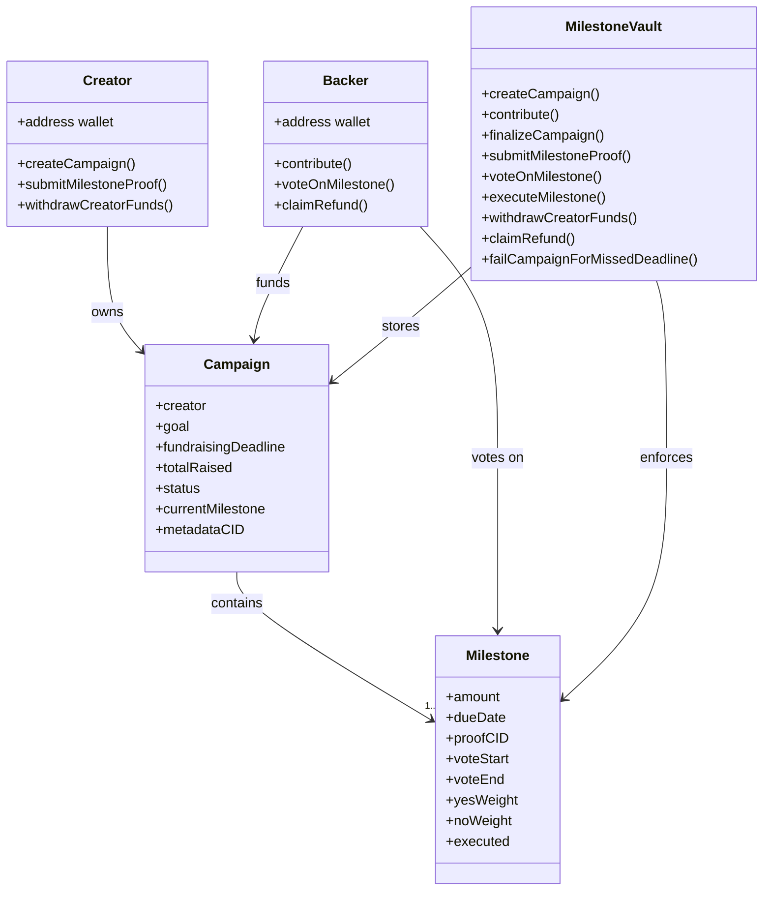
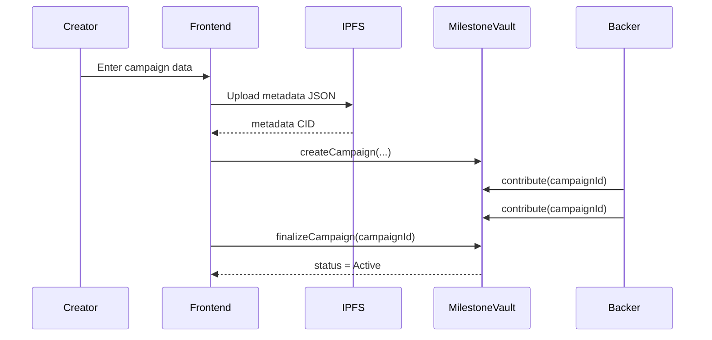
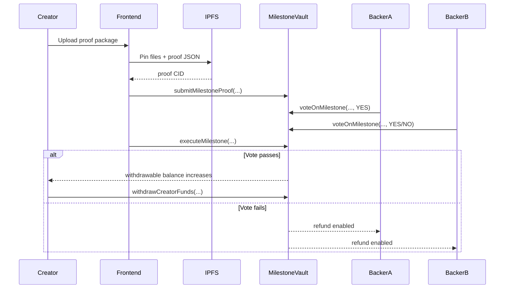
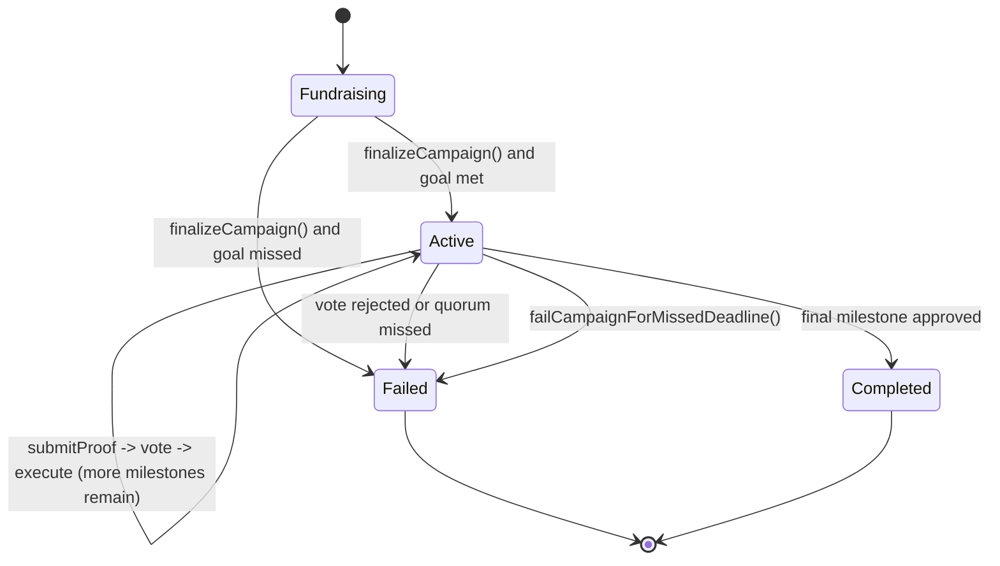
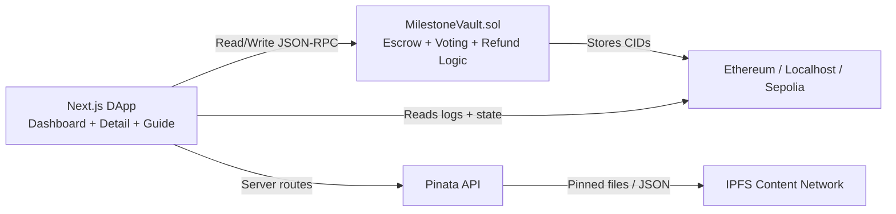

# MilestoneVault UML Diagrams

## 1. Domain Class Diagram

```mermaid
classDiagram
    class Creator {
      +address wallet
      +createCampaign()
      +submitMilestoneProof()
      +withdrawCreatorFunds()
    }

    class Backer {
      +address wallet
      +contribute()
      +voteOnMilestone()
      +claimRefund()
    }

    class Campaign {
      +creator
      +goal
      +fundraisingDeadline
      +totalRaised
      +status
      +currentMilestone
      +metadataCID
    }

    class Milestone {
      +amount
      +dueDate
      +proofCID
      +voteStart
      +voteEnd
      +yesWeight
      +noWeight
      +executed
    }

    class MilestoneVault {
      +createCampaign()
      +contribute()
      +finalizeCampaign()
      +submitMilestoneProof()
      +voteOnMilestone()
      +executeMilestone()
      +withdrawCreatorFunds()
      +claimRefund()
      +failCampaignForMissedDeadline()
    }

    Creator --> Campaign : owns
    Campaign --> "1..*" Milestone : contains
    Backer --> Campaign : funds
    Backer --> Milestone : votes on
    MilestoneVault --> Campaign : stores
    MilestoneVault --> Milestone : enforces
```

## 2. Funding And Activation Sequence

```mermaid
sequenceDiagram
    participant Creator
    participant Frontend
    participant IPFS
    participant Vault as MilestoneVault
    participant Backer

    Creator->>Frontend: Enter campaign data
    Frontend->>IPFS: Upload metadata JSON
    IPFS-->>Frontend: metadata CID
    Frontend->>Vault: createCampaign(...)
    Backer->>Vault: contribute(campaignId)
    Backer->>Vault: contribute(campaignId)
    Frontend->>Vault: finalizeCampaign(campaignId)
    Vault-->>Frontend: status = Active
```

## 3. Milestone Approval Sequence

```mermaid
sequenceDiagram
    participant Creator
    participant Frontend
    participant IPFS
    participant Vault as MilestoneVault
    participant BackerA
    participant BackerB

    Creator->>Frontend: Upload proof package
    Frontend->>IPFS: Pin files + proof JSON
    IPFS-->>Frontend: proof CID
    Frontend->>Vault: submitMilestoneProof(...)
    BackerA->>Vault: voteOnMilestone(..., YES)
    BackerB->>Vault: voteOnMilestone(..., YES/NO)
    Frontend->>Vault: executeMilestone(...)
    alt Vote passes
      Vault-->>Creator: withdrawable balance increases
      Creator->>Vault: withdrawCreatorFunds(...)
    else Vote fails
      Vault-->>BackerA: refund enabled
      Vault-->>BackerB: refund enabled
    end
```

## 4. State Diagram

```mermaid
stateDiagram-v2
    [*] --> Fundraising
    Fundraising --> Active: finalizeCampaign() and goal met
    Fundraising --> Failed: finalizeCampaign() and goal missed
    Active --> Active: submitProof -> vote -> execute (more milestones remain)
    Active --> Completed: final milestone approved
    Active --> Failed: vote rejected or quorum missed
    Active --> Failed: failCampaignForMissedDeadline()
    Failed --> [*]
    Completed --> [*]
```

## 5. Component Diagram

```mermaid
flowchart LR
    FE["Next.js DApp\nDashboard + Detail + Guide"] -->|Read/Write JSON-RPC| SC["MilestoneVault.sol\nEscrow + Voting + Refund Logic"]
    FE -->|Server routes| PIN["Pinata API"]
    PIN -->|Pinned files / JSON| IPFS["IPFS Content Network"]
    SC -->|Stores CIDs| ETH["Ethereum / Localhost / Sepolia"]
    FE -->|Reads logs + state| ETH
```
